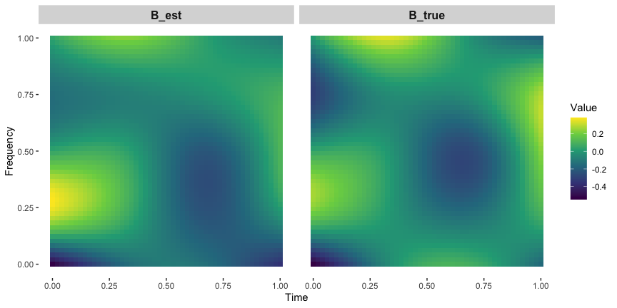

BMEF: Bayesian Mixed-Effects Models for Multilevel Two-way Functional
Data
================
2025-07-11

This repository contains `R` code implementing Bayesian mixed-Effects
models for multilevel two-way functional data (BMEF) . The package can
be installed as follows:

``` r
devtools::install_github("xmengju/BMEF")
```

------------------------------------------------------------------------

## Simulate Data and Fit the Model

``` r
#library(BMEF)
devtools::load_all(".")
```

    ## ℹ Loading BMEF

``` r
library(pracma)
library(splines)

# Simulation setup
n <- 50       # number of subjects
J <- 4        # number of conditions
TT <- 50      # time points
FF <- 50      # frequency points
K_T <- 4      # time basis functions
K_F <- 5      # frequency basis functions
R <- 2        # true rank
p <- 2        # number of covariates

set.seed(1)
U <- randortho(K_T)[, 1:R]
V <- randortho(K_F)[, 1:R]
X <- cbind(1, runif(n, -3, 3))

Sigma2s <- list(
  Sigma2_epsilon = 0.05^2,
  Sigma2_gamma = 0.2^2,
  Sigma2_omega = runif(n, 0.2^2)
)

Delta <- array(runif(J * R * p, 0.5, 1), dim = c(J, R, p)) 
entries_idx <- rbinom(J * R * p, 1, 0.5)
Delta[entries_idx] <- -Delta[entries_idx]

# Generate synthetic data
dat <- dat.gen(seed = 1, n, J, TT, FF, K_T, K_F, U, V, Delta, X, Sigma2s)

# Fit BMEF models
n_burn <- 1000
n_sample <- 200
tt <- dat$tt
ff <- dat$ff
Y <- dat$Y
JJ <- matrix(1, n, J)
R_max <- 4

bmef_1 <- bmef(Y, X, JJ, tt, ff, R = R_max, K_T, K_F, n_burn, n_sample,
               params = NULL, alg_type = "BMEF-1", threshold = 0.01, save_all = FALSE)
```

    ## [1] "100-th iteration"
    ## [1] "200-th iteration"
    ## [1] "300-th iteration"
    ## [1] "400-th iteration"
    ## [1] "500-th iteration"
    ## [1] "600-th iteration"
    ## [1] "700-th iteration"
    ## [1] "800-th iteration"
    ## [1] "900-th iteration"
    ## [1] "1000-th iteration"
    ## [1] "1100-th iteration"
    ## [1] "1200-th iteration"

``` r
bmef_2 <- bmef(Y, X, JJ, tt, ff, R = R_max, K_T, K_F, n_burn, n_sample,
               params = NULL, alg_type = "BMEF-2", threshold = 0.01, save_all = FALSE)
```

    ## [1] "100-th iteration"
    ## [1] "200-th iteration"
    ## [1] "300-th iteration"
    ## [1] "400-th iteration"
    ## [1] "500-th iteration"
    ## [1] "600-th iteration"
    ## [1] "700-th iteration"
    ## [1] "800-th iteration"
    ## [1] "900-th iteration"
    ## [1] "1000-th iteration"
    ## [1] "1100-th iteration"
    ## [1] "1200-th iteration"

------------------------------------------------------------------------

## Summary of Posterior Inference

``` r
# Posterior inference on fixed and random effects
bmef_obj <- bmef_2
cred_level <- 0.95

res_infer_decompose <- inference.decompose.bmef(bmef_obj, cred_level)
res_infer_mixed <- inference.mixed.bmef(bmef_obj)
```

------------------------------------------------------------------------

## Visualization

``` r
library(tidyr)
library(ggplot2)
```

    ## Warning: package 'ggplot2' was built under R version 4.4.1

``` r
library(gridExtra)

subject_idx <- 1  # subject index to make inference of
condition_idx <- 1  # condition index to make inference of

grid <- expand.grid(tt = tt, ff = ff)
grid$A_est <- c(res_infer_mixed$A_s[subject_idx, condition_idx,,])
grid$A_true<-dat$O_tilde%*%c(dat$A[subject_idx, condition_idx,,])

grid$B_est <- c(res_infer_mixed$B_s[subject_idx, ,])
grid$B_true<-dat$O_tilde%*%c(dat$B[subject_idx, ,])

grid$C_est <- c(res_infer_mixed$C_s[subject_idx, condition_idx,,])
grid$C_true<-dat$O_tilde%*%c(dat$C[subject_idx, condition_idx,,])

df_long <- pivot_longer(grid, 
                          cols = c("A_est", "A_true",
                                   "B_est", "B_true",
                                   "C_est", "C_true"), 
                          names_to = "type") 
colnames(df_long)[4] <- "value"

# compare estimated A with true A
p_A <- ggplot(df_long %>%dplyr::filter(type %in% c("A_est", "A_true")), aes(x = tt, y = ff, fill = value)) +
  geom_tile() +
  scale_fill_viridis_c() +  # Heatmap color scale
  facet_wrap(~type,nrow = 1) + 
  labs(x = "Time",
       y = "Frequency",
       fill = "Value") +    theme(panel.background = element_blank(),
                                  plot.background = element_blank(),
                                  panel.grid.major.x = element_blank(),   
                                  panel.grid.minor.x = element_blank()
       )  +  theme(strip.text = element_text(size = 12, face = "bold"))


plot(p_A)
```

<!-- -->

``` r
# compare estimated B with true B
p_B <- ggplot(df_long %>%dplyr::filter(type %in% c("B_est", "B_true")), aes(x = tt, y = ff, fill = value)) +
  geom_tile() +
  scale_fill_viridis_c() +  # Heatmap color scale
  facet_wrap(~type,nrow = 1) + 
  labs(x = "Time",
       y = "Frequency",
       fill = "Value") +    theme(panel.background = element_blank(),
                                  plot.background = element_blank(),
                                  panel.grid.major.x = element_blank(),   
                                  panel.grid.minor.x = element_blank()
       )  +  theme(strip.text = element_text(size = 12, face = "bold"))
  
plot(p_B)
```

<!-- -->

``` r
# compare estimated C with true C
p_C <- ggplot(df_long %>%dplyr::filter(type %in% c("C_est", "C_true")), aes(x = tt, y = ff, fill = value)) +
  geom_tile() +
  scale_fill_viridis_c() +  # Heatmap color scale
  facet_wrap(~type,nrow = 1) + 
  labs(x = "Time",
       y = "Frequency",
       fill = "Value") +    theme(panel.background = element_blank(),
                                  plot.background = element_blank(),
                                  panel.grid.major.x = element_blank(),   
                                  panel.grid.minor.x = element_blank()
       )  +  theme(strip.text = element_text(size = 12, face = "bold"))
  
plot(p_C)
```

<!-- -->

## Make inference of the two-way “base” patterns and marginal “principal” functions

``` r
Rs <- dim(bmef_obj$v_s)[2]
patch_list <- list() # store plots for the two-way base patterns
pt_list <- list() # store plots for the marginal function for t
pf_list <- list()  # store plots for the marginal function for f

for(r in 1:Rs){
  
  grid <- expand.grid(tt = tt, ff = ff)
  grid$base <- c(res_infer_decompose$base_patterns$m[r,,]) # posterior median
  

  patch_list[[r]] <-  ggplot(grid, aes(x = tt, y = ff, fill = base)) +
  geom_tile() +  scale_fill_viridis_c() +  labs(x = "t (Sec)",
       y = "f (Hz)",  fill = " ") +  theme(panel.background = element_blank(),
                              plot.background = element_blank(),
                              panel.grid.major.x = element_blank(),   
                              panel.grid.minor.x = element_blank()
       ) +theme(legend.position  = "left")
  
  
  data_t <- data.frame(x = tt,  mean = res_infer_decompose$marginal_t$m[r,],
    lower_95 = res_infer_decompose$marginal_t$l[r,], upper_95 =res_infer_decompose$marginal_t$u[r,])
 
  data_f <- data.frame(x = ff,  mean = res_infer_decompose$marginal_f$m[r,],
    lower_95 = res_infer_decompose$marginal_f$l[r,], upper_95 =res_infer_decompose$marginal_f$u[r,])
  
  pt_list[[r]] = ggplot(data_t, aes(x = x)) +  geom_ribbon(aes(ymin = lower_95, ymax =  upper_95), fill = "gray60", alpha = 0.5) +     geom_line(aes(y = mean), color = "black", linewidth = 0.6) +  labs(y = expression(phi[1]^"*"~"(t)"),
           x = "t (Sec)")
  
  pf_list[[r]] = ggplot(data_f, aes(x = x)) +  geom_ribbon(aes(ymin = lower_95, ymax = upper_95), fill = "gray60", alpha = 0.5) +   geom_line(aes(y = mean), color = "black", linewidth = 0.6) +   labs(y = expression(psi[1]^"*"~"(f)"),
           x = "f (Hz)")
    
}


grid.arrange( patch_list[[1]], pt_list[[1]], pf_list[[1]], 
              patch_list[[2]],  pt_list[[2]], pf_list[[2]], 
                    nrow = 2, ncol= 3, heights = c(1,1), widths = c(1.3,1,1))
```

<!-- -->
